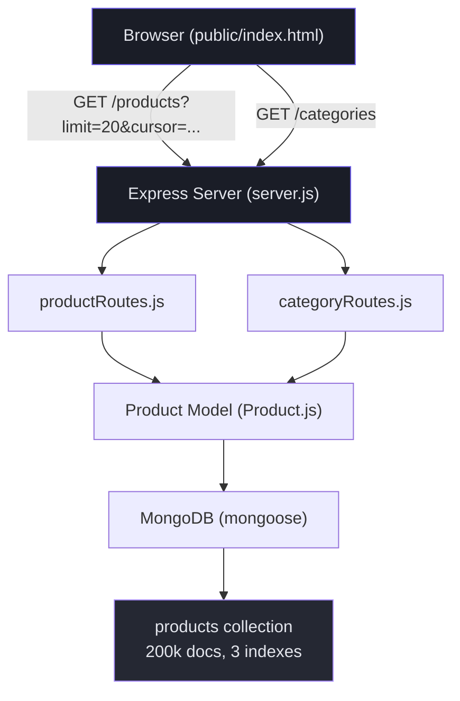
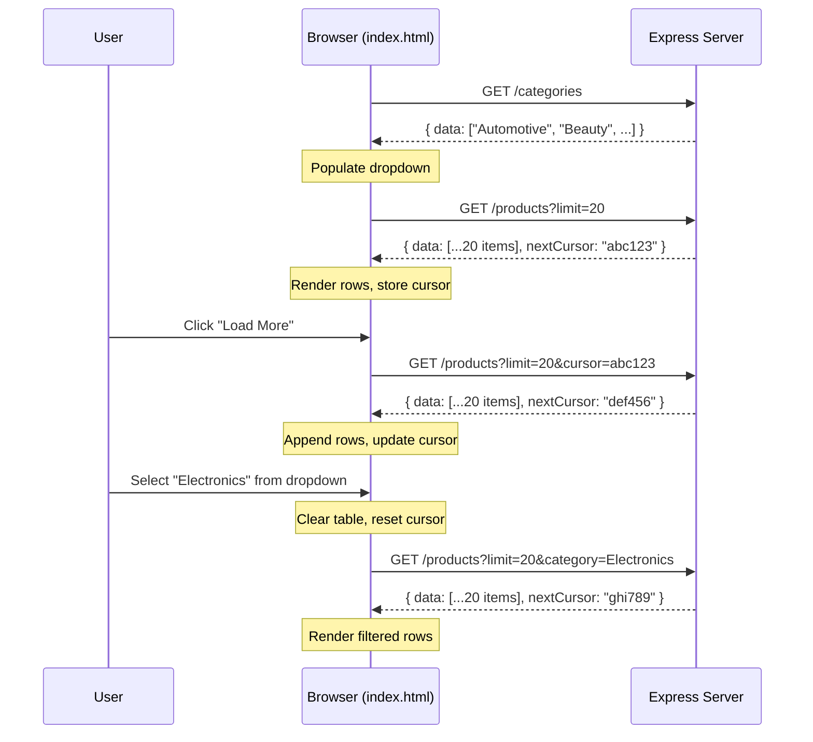

# Architecture — Deep Technical Walkthrough

## What This Project Does (The 30-Second Pitch)

This is a **REST API** that serves a catalog of 200,000 products with **cursor-based pagination**. The core problem it solves:

> "How do you paginate through a huge dataset without duplicating or skipping items when new data is being inserted?"

The naive approach (`skip()/offset`) breaks at scale — it's slow on deep pages and produces duplicates/skips when data changes. This project demonstrates the correct approach: **keyset (cursor) pagination** using a compound sort key `(createdAt, _id)` backed by MongoDB indexes.

---

## Architecture Overview



The architecture is intentionally simple — a standard **3-layer Node.js backend**:

| Layer | Files | Responsibility |
|-------|-------|----------------|
| **Entry point** | `server.js` | Express app setup, middleware, route registration, static file serving |
| **Routes** | `src/routes/productRoutes.js`, `src/routes/categoryRoutes.js` | HTTP request handling, query param parsing, cursor encode/decode |
| **Models** | `src/models/Product.js` | Mongoose schema, validation, indexes, hooks |
| **Config** | `src/config/db.js` | MongoDB connection logic |
| **Scripts** | `src/scripts/seed.js`, `validatePagination.js`, `perfValidation.js` | Data seeding, correctness tests, benchmarks |
| **UI** | `public/index.html` | Static HTML/CSS/JS frontend |

---

## File-by-File Deep Dive

### 1. `server.js` — The Entry Point

```
require("dotenv").config()  →  loads .env (MONGO_URI, PORT)
        ↓
express()  →  creates the app
        ↓
Middleware:  cors(), express.json(), express.static("public/")
        ↓
Routes:  /products → productRoutes,  /categories → categoryRoutes
        ↓
connectDB()  →  connects to MongoDB
        ↓
app.listen(PORT)  →  starts the server
```

**Key points:**
- `express.static("public/")` serves the UI at `/` — the HTML file makes API calls to the same origin, no CORS issues
- `cors()` is included for cases where the UI is hosted separately (e.g., a React app on a different port)
- The health check endpoint is at `/api/health` (not `/`) so it doesn't conflict with the static UI

---

### 2. `Product.js` — The Schema & Indexes

This is where most of the important design decisions live.

#### The Schema

```javascript
{
  name:      { type: String, required: true, trim: true },
  category:  { type: String, required: true, trim: true },
  price:     { type: Number, required: true, min: 0 },
  createdAt: { type: Date, default: Date.now },
  updatedAt: { type: Date, default: Date.now },
}
```

**Why explicit `createdAt`/`updatedAt` instead of `timestamps: true`?**

Mongoose's `timestamps: true` auto-manages both fields. That's fine for normal app usage, but the **seed script** needs to set `createdAt` manually to spread products across a 2-year historical range. With explicit fields:
- The seed script passes any `createdAt` value it wants
- For normal app inserts, `default: Date.now` kicks in automatically
- A `pre('save')` hook auto-updates `updatedAt` on every save

The seed script uses `insertMany()`, which **bypasses save hooks** — this is intentional so the seed-controlled `updatedAt` isn't overwritten.

#### The Indexes

```javascript
productSchema.index({ createdAt: -1, _id: -1 });
productSchema.index({ category: 1, createdAt: -1, _id: -1 });
```

**Index 1: `{ createdAt: -1, _id: -1 }`**

This supports the "all products, newest first" query. MongoDB can walk this index in order to satisfy both the sort and the range condition — no in-memory sort needed.

**Index 2: `{ category: 1, createdAt: -1, _id: -1 }`**

This is a **compound index** designed for the ESR (Equality-Sort-Range) pattern:
- **E**quality: `category = "Electronics"` → narrows to just that category's portion of the index
- **S**ort: `createdAt: -1, _id: -1` → already in index order, so no in-memory sort
- **R**ange: `createdAt < lastCreatedAt` → starts scanning from the cursor position

Without this index, Mongo would have to: filter all 200k docs for the category → sort the results in memory → take `limit` items. With it, Mongo does a single index scan and stops after `limit` items.

---

### 3. `productRoutes.js` — The Cursor Pagination Logic

This is the core of the project. Let me walk through the full request lifecycle.

#### Step 1: Cursor Encoding/Decoding

```javascript
// ENCODE: take the last document and create an opaque cursor
function encodeCursor(doc) {
  const payload = JSON.stringify({
    createdAt: doc.createdAt.toISOString(),
    _id: doc._id.toString(),
  });
  return Buffer.from(payload).toString("base64url");
}

// DECODE: parse the cursor back into values
function decodeCursor(cursorStr) {
  const json = Buffer.from(cursorStr, "base64url").toString("utf8");
  const { createdAt, _id } = JSON.parse(json);
  return { lastCreatedAt: new Date(createdAt), lastId: _id };
}
```

**Why Base64url?**
- **Opaque** — the client can't see or assume the internal structure
- **URL-safe** — no `+`, `/`, or `=` characters that need escaping
- **Single token** — the client passes one string, not two separate params
- **Changeable** — we can change what's inside the cursor without breaking clients

The cursor contains exactly two values: the `createdAt` and `_id` of the last document the client saw. These are the two components of our sort key.

#### Step 2: Building the Query (First Page)

When there's **no cursor** (first page), the query is simple:

```javascript
// No cursor — just filter + sort + limit
filter = { category: "Electronics" }  // or {} if no category
sort   = { createdAt: -1, _id: -1 }
limit  = 20
```

MongoDB uses the index to find the 20 newest documents matching the filter.

#### Step 3: Building the Query (Subsequent Pages)

When there **is** a cursor, this is where the magic happens:

```javascript
// Cursor present — add the range condition
filter = {
  $and: [
    { category: "Electronics" },
    {
      $or: [
        { createdAt: { $lt: lastCreatedAt } },
        { createdAt: lastCreatedAt, _id: { $lt: lastId } },
      ]
    }
  ]
}
```

**Why the `$or` with two conditions?**

This is the **keyset pagination range trick** for compound sort keys. Let me explain with an example:

Imagine the sort order looks like this (newest first):

```
Doc A:  createdAt = 2026-06-23T12:00:00.500Z,  _id = "aaa"
Doc B:  createdAt = 2026-06-23T12:00:00.500Z,  _id = "bbb"  ← cursor points here
Doc C:  createdAt = 2026-06-23T12:00:00.500Z,  _id = "ccc"
Doc D:  createdAt = 2026-06-23T12:00:00.499Z,  _id = "ddd"
Doc E:  createdAt = 2026-06-23T12:00:00.498Z,  _id = "eee"
```

If the cursor is on **Doc B**, we want to get **C, D, E** (everything after B in sort order).

- **Condition 1:** `createdAt < 2026-06-23T12:00:00.500Z` → catches D, E (different timestamp, clearly older)
- **Condition 2:** `createdAt == 2026-06-23T12:00:00.500Z AND _id < "bbb"` → catches C (same timestamp, but `_id` tiebreaker says it's "after" B in descending `_id` order)

If we only used `createdAt < lastCreatedAt` (without the `$or`), we'd **skip Doc C entirely** because it has the same `createdAt` as the cursor. This is exactly the bug that naive `createdAt`-only sorting produces.

> **⚠️ IMPORTANT:** The `$or` condition is the single most important piece of logic in the project. It's what makes cursor pagination correct when documents share the same timestamp — and correctness of this edge case is explicitly validated with a dedicated, identical-timestamp test fixture in `validatePagination.js` Test 4.

#### Step 4: Building the Response

```javascript
const products = await Product.find(filter)
  .sort({ createdAt: -1, _id: -1 })
  .limit(limit)
  .lean();

let nextCursor = null;
if (products.length === limit) {
  nextCursor = encodeCursor(products[products.length - 1]);
}

return res.json({ data: products, nextCursor });
```

- `.lean()` returns plain objects instead of Mongoose documents (faster, less memory)
- `nextCursor` is `null` when fewer than `limit` docs were returned — this signals "end of list" to the client
- The cursor is built from the **last document** in the result set

---

### 4. Why Cursor Pagination Is Stable Under Inserts

This is the key interview talking point. Here's a visual:

```
Timeline of events:
━━━━━━━━━━━━━━━━━━━━━━━━━━━━━━━━━━━━━━━━━━━━━

1. User fetches page 1 (20 items, newest first)
   Gets items with createdAt: June 20 → June 19
   Cursor points to: June 19, _id = "xyz"

2. Meanwhile: 50 NEW products are inserted (createdAt = June 23)

3. User fetches page 2 using cursor from step 1
   Query: WHERE createdAt < June 19 OR (createdAt = June 19 AND _id < "xyz")
   
   The 50 new products (June 23) are INVISIBLE to this query
   because June 23 is NOT < June 19.
   
   ✅ No duplicates. No skips. Page 2 picks up exactly where page 1 left off.

4. If the user goes back to page 1 (no cursor), they see the 50 new items at the top.
   ✅ New data is visible on fresh queries.
```

**With offset/skip pagination**, step 3 would break:
- The 50 new items push everything down by 50 positions
- `skip(20)` would now skip items 1–20 of the *new* ordering, not the old one
- Result: some items from the original page 1 would repeat on page 2

---

### 5. `seed.js` — How 200k Products Get Inserted

The seed script is designed for **speed** and **realistic data**:

```
200,000 docs ÷ 5,000 per batch = 40 insertMany() calls
```

**Why batched `insertMany()` instead of a loop with `insertOne()`?**
- Each `insertOne()` is a separate network round-trip to MongoDB
- 200k round-trips at ~1ms each = ~200 seconds
- 40 batched `insertMany()` calls = ~7s (**~30× faster**)

**Data generation strategy:**

| Field | How it's generated |
|-------|-------------------|
| `name` | Random `adjective + noun` from small pools (15 × 15 = 225 combos) |
| `category` | Weighted random from 13 categories — Electronics/Clothing/Home are repeated more in the source array, so they end up with more products |
| `price` | Random 1.00–1000.00, fixed to 2 decimals |
| `createdAt` | **Sequential walk** across 2 years with ±50ms jitter — products are roughly time-ordered, but many share the same millisecond (intentionally exercises the `_id` tiebreaker) |
| `updatedAt` | Set equal to `createdAt` for seed data |

**Idempotency:** The script drops the `products` collection before inserting, so re-running always produces exactly 200,000 documents.

---

### 6. `public/index.html` — The UI Data Flow

The UI is a single static file with no framework. Here's how data flows:



**Key UI behaviors:**
- Changing the category **resets** pagination (clears the table, sets cursor to null)
- "Load More" **appends** rows with a fade-in animation
- When `nextCursor` is `null`, the button is replaced with "✓ End of list"
- The counter updates in real-time showing total products loaded

---

### 7. Validation Scripts — What They Prove

#### `validatePagination.js` — Correctness (28 assertions, 0 failures)

| Test | What it proves |
|------|---------------|
| **Mid-pagination insert** | Insert 50 products between page 1 & 2 → zero overlap, zero leaked new docs |
| **Category + pagination** | 5 pages of Electronics → every doc is Electronics, zero duplicates, correct sort |
| **Last-page boundary** | 25 docs with limit=10 → 3 pages (10, 10, 5), last page has `nextCursor: null` |
| **Same-createdAt collisions** | 100 docs with identical timestamp, limit=7 → 15 pages, zero duplicates, zero skips |

#### `perfValidation.js` — Performance

| Test | What it proves |
|------|---------------|
| **Deep cursor explain** | IXSCAN, 20 docs examined for 20 returned (even 100k deep), <1ms |
| **Category cursor explain** | IXSCAN, uses the compound category index, 2ms |
| **Cursor vs skip() benchmark** | At 190k depth: skip ≈ 252ms, cursor ≈ 2ms → **~126× faster** |

**Full benchmark table (from latest run):**

| Depth | skip() | cursor | Speedup |
|-------|--------|--------|---------|
| 100 | 4 ms | 3 ms | 1.3× |
| 1,000 | 3 ms | 2 ms | 1.5× |
| 10,000 | 8 ms | 2 ms | 4× |
| 50,000 | 67 ms | 4 ms | 16.8× |
| 100,000 | 121 ms | 2 ms | 60.5× |
| 190,000 | 252 ms | 2 ms | **126×** |

---

## The Complete Request Lifecycle (End-to-End)

Here's what happens when a user clicks "Load More" on page 5 with category "Electronics":

```
1. Browser has cursor: "eyJjcmVhdGVkQXQiOiIyMDI1LTA3LTAxVDEwOjAwOjA..."

2. Browser sends: GET /products?limit=20&category=Electronics&cursor=<above>

3. Express routes to productRoutes.js

4. Route handler:
   a. Parses limit=20, category="Electronics", cursor=<string>
   b. Decodes cursor → { lastCreatedAt: 2025-07-01T10:00:00.000Z, lastId: "6a3a..." }
   c. Builds filter:
      { $and: [
          { category: "Electronics" },
          { $or: [
              { createdAt: { $lt: 2025-07-01T10:00:00.000Z } },
              { createdAt: 2025-07-01T10:00:00.000Z, _id: { $lt: "6a3a..." } }
          ]}
      ]}
   d. Executes: Product.find(filter).sort({createdAt:-1, _id:-1}).limit(20).lean()

5. MongoDB query planner:
   a. Sees the compound index { category: 1, createdAt: -1, _id: -1 }
   b. Seeks to category="Electronics", createdAt ≤ 2025-07-01, _id < "6a3a..."
   c. Scans forward in index order, returns first 20 matching docs
   d. Total docs examined: 20 (not 200,000!)

6. Route handler:
   a. Gets 20 products back
   b. Takes the last one, encodes its (createdAt, _id) as the new cursor
   c. Returns: { data: [...20 products], nextCursor: "new-cursor-string" }

7. Browser:
   a. Appends 20 new rows to the table with fade-in animation
   b. Stores the new cursor for the next "Load More" click
   c. Updates counter: "Showing 100 products"
```

---

## Quick Reference — Commands

| Command | What it does |
|---------|-------------|
| `npm install` | Install dependencies |
| `npm run seed` | Seed 200k products (drops existing, safe to re-run) |
| `npm run dev` | Start server with nodemon (hot-reload) |
| `npm start` | Start server (production) |
| `node src/scripts/validatePagination.js` | Run correctness tests (server must be running) |
| `node src/scripts/perfValidation.js` | Run performance benchmarks |
